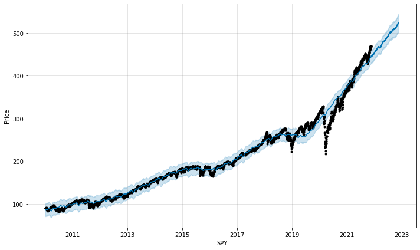
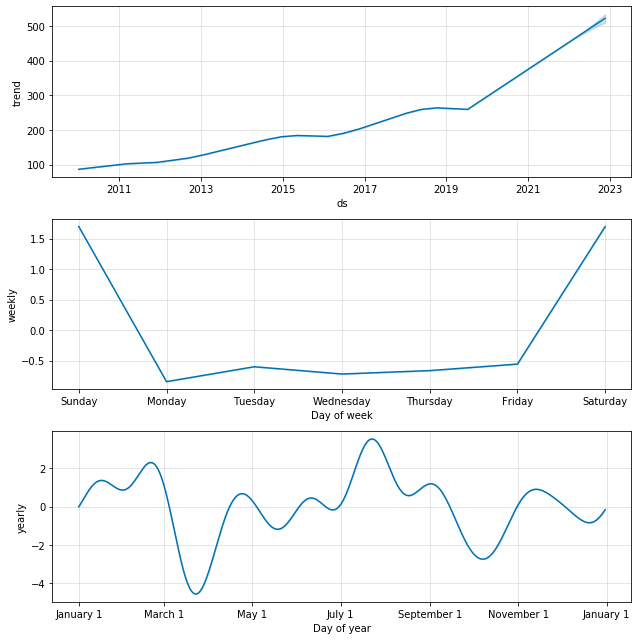
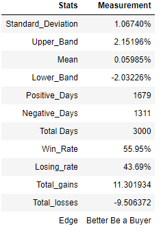
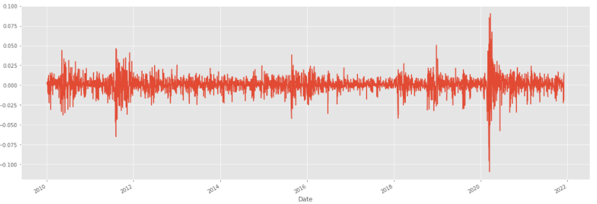
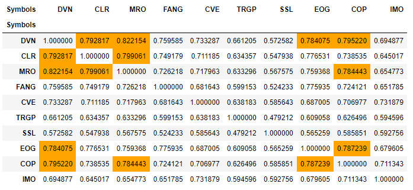
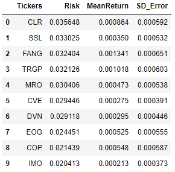
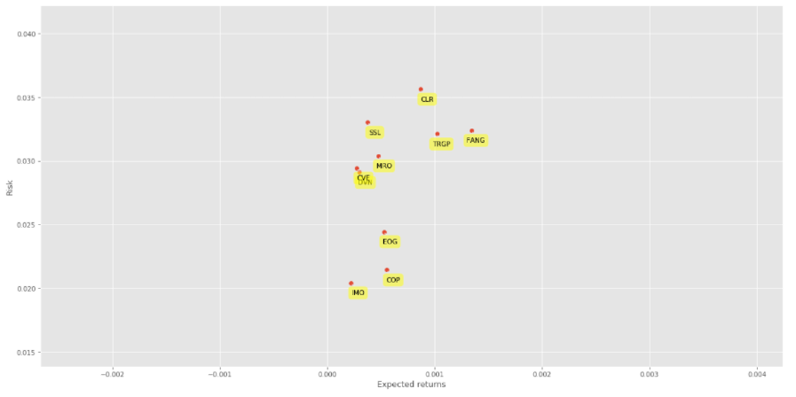

# Stock-Analysis-Tools
Prophet Stock Price Prediction
This information contained on this notebook and the resources avaiable for dowload through this website is not intended as, and shall not be understood or contruced as, financial advice!I developed this tool mainly to gain more experience in time series analysis and object-oriented programming. The goal is to combine different machine learning methods for stock analysis. I will occasionally update this project by adding more functions.
# Libraries for the project
* [Pandas](https://pandas.pydata.org)
* [Pandas-datareader](https://pandas-datareader.readthedocs.io/en/latest)
* [Datetime](https://docs.python.org/3/library/datetime.html)
* [Prophet](https://facebook.github.io/prophet/docs/installation.html#installation-in-python)
* [Matplotlib](https://matplotlib.org)
# Results from the Prophet prediction
### Example of Stock Price Prediction

```
from metaprodictor import Prodictor

ticker = 'spy' 
days = 365 
test_ticker = Prodictor(ticker) 
test_ticker.predict(days)
```
* Prophet stock price prediction



### Example of Stock Trend Analysis

```
test_ticker.trend_analizer(365)
```
* Seasonal Trend



### Example of Stocks Daily Return Stats Analysis

```
test_ticker.daily_return()
```
* Winning Rate = Daily_Return(>0)/total trading days; Total_gains = accumulate all positive % returns (close to close)



* Daily Return (%) Chart



### Example of Stocks Daily Return Correlation Matrix
```
from metaprodictor import Corranalyzer

ticker_group = ['DVN','CLR','MRO','FANG','CVE','TRGP','SSL','EOG','COP','IMO']
highlight = 0.78 # highlight if correlation is greater than 0.78

b = Corranalyzer(ticker_group)
b.matrixCorrl(highlight)
```

* Correlation Matrix for Energy Stocks



### Example of Stocks Daily Return Risk/Return Chart
```
b.riskRank()
```
* Ranking from Highest Risk



* Risk VS Return


