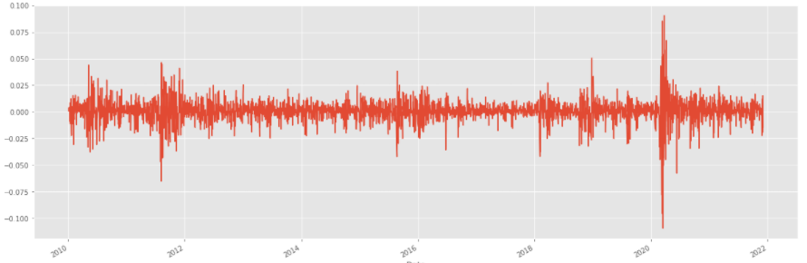
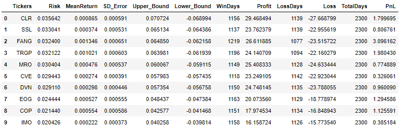

# Stock-Analysis-Tools
Prophet Stock Price Prediction
This information contained on this notebook and the resources avaiable for dowload through this website is not intended as, and shall not be understood or contruced as, financial advice!I developed this tool mainly to gain more experience in time series analysis and object-oriented programming. The goal is to combine different machine learning methods for stock analysis. I will occasionally update this project by adding more functions. (*** Stock historical price data is from Yahoo Finance)
# Libraries for this project
* [Pandas](https://pandas.pydata.org)
* [Pandas-datareader](https://pandas-datareader.readthedocs.io/en/latest)
* [Datetime](https://docs.python.org/3/library/datetime.html)
* [Prophet](https://facebook.github.io/prophet/docs/installation.html#installation-in-python)
* [Matplotlib](https://matplotlib.org)
# Examples
## For Single Stock Analysis

```
from metaprodictor import Prodictor

ticker = 'spy' # put your stock here
days = 365 
test_ticker = Prodictor(ticker) 
```

### Example of Stocks Open To Close Return Stats Analysis

```
test_ticker.oTc_return()
```
* Winning Rate = Daily_Return(>0)/total trading days; Total_gains = accumulate all positive % returns (close to close)


* Open to Close Rate of Return (%) Chart


### Example of Stocks Close To Close Return Stats Analysis

```
test_ticker.cTc_return()
```
* Winning Rate = Daily_Return(>0)/total trading days; Total_gains = accumulate all positive % returns (close to close)


* Close to Close Rate of Return (%) Chart



### Example of Finding Out the Best Holding periods that gernerate the max profit within a year (252 trading days)
```
test_ticker.zTc_return(252)
```


* Rate of Return (%) 


### Example of Stocks Daily Return Correlation Matrix for Energy Stocks
```
from metaprodictor import Corranalyzer

ticker_group = ['DVN','CLR','MRO','FANG','CVE','TRGP','SSL','EOG','COP','IMO'] #Put your stocks here
highlight = 0.78 # highlight if correlation is greater than 0.78

b = Corranalyzer(ticker_group)
b.matrixCorrl(highlight)
```
### Truning Point Analysis
Apply Prophet and detects changepoints by first specifying a large number of potential changepoints at which the rate is allowed to change. It then puts a sparse prior on the magnitudes of the rate changes (equivalent to L1 regularization) - this essentially means that Prophet has a large number of possible places where the rate can change, but will use as few of them as possible. Consider the Peyton Manning forecast from the Quickstart. By default, Prophet specifies 25 potential changepoints which are uniformly placed in the first 80% of the time series. The vertical lines in this figure indicate where the potential changepoints were placed: "https://facebook.github.io/prophet/docs/trend_changepoints.html" for detail
```
test.turningPoint()
```


### Example of Stock Trend Analysis

```
test_ticker.trend_analizer(365)
```
* Seasonal Trend


## For Portfolio Analysis
### Correlation Matrix for Energy Stocks


### Daily Return Risk/Return Chart and Concise Summary of the Past Performance
```
b.riskRank()
```
* Ranking from Highest Risk



* Risk VS Return (**Risk is Standard Deviation of the mean, Risk of 0.03564 = SD of 3.564%)


